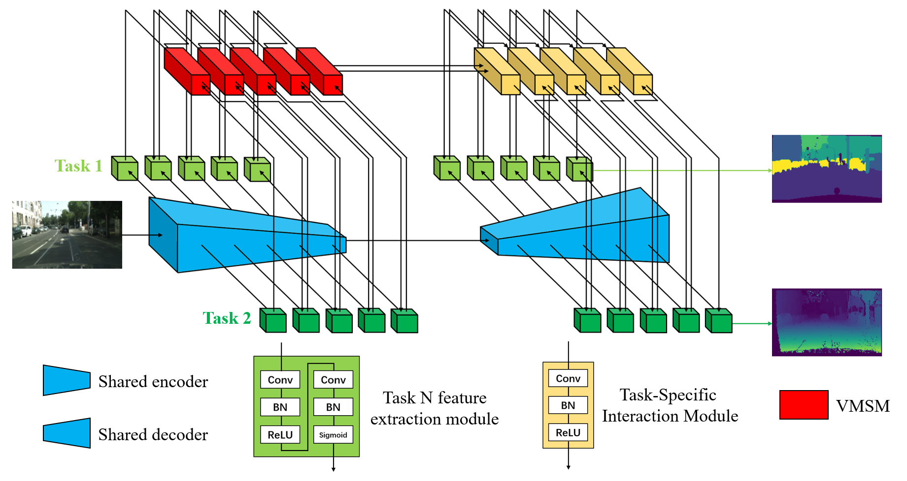

# Net-Opt-MTL
一个应用于计算机视觉的多任务学习模型

## Network Framework Diagram (VMSANEt)

<p align="center">
  
</p>

## 1. Preparation
We provide pytorch compressed files for Ubuntu environment (recommended to use virtual environment)

Python 3.8 (Ubuntu 18.04)

Cuda  11.1

### requirement
matplotlib==3.6.2

numpy==1.26.4

pandas==2.2.2

pillow==10.4.0

scikit-learn==1.4.2

scipy==1.13.1

torch==2.4.0

torchvision==0.19.0

tqdm==4.66.4

## 2. Datasets

* **CITYSCAPES**: The preprocessed (normalized) Cityscapes dataset
  ```
  <Cityscapes>/                     % Cityscapes dataset root
      |
      ├── train/
      |     ├── image/              % Input image
      |     ├── label/              % Semantic segmentation labels (7 categories)
      |     └── depth/              % Depth estimation label
      |
      └── val/
            ├── image/              % Input image
            ├── label/              % Semantic segmentation labels (7 categories)
            └── depth/              % Depth estimation label
  ```

  * **Nyuv2**: Indoor scene dataset
  ```
  <Nyuv2>/                          % Nyuv2 dataset root
      |
      ├── train/
      |     ├── image/              % Input image
      |     ├── label/              % Semantic segmentation labels (13 categories)
      |     └── depth/              % Depth estimation label
      |
      └── val/
            ├── image/              % Input image
            ├── label/              % Semantic segmentation labels (13 categories)
            └── depth/              % Depth estimation label
  ```

    * **KITTI**: Outdoor scene synthesis dataset
  ```
  <Nyuv2>/                          % KITTI dataset root
      |
      ├── train/
      |     ├── image/              % Input image
      |     ├── label/              % Semantic segmentation labels (14 categories)
      |     └── depth/              % Depth estimation label
      |
      └── val/
            ├── image/              % Input image
            ├── label/              % Semantic segmentation labels (14 categories)
            └── depth/              % Depth estimation label
  ```

## 3. Program running

- Single task learning baseline:
  ```
  python Single_task.py --task=semantic/depth/...
  ```
  
- Other tasks learning:
  ```
  python model_name.py
  ```
